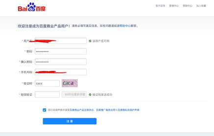

[[toc]]

## 注册百度商业账号

[链接]: https://u.baidu.com/ucweb/?module=Reguser&controller=reg&action=index&appid=12&nexturl=https%3A%2F%2Ftongji.baidu.com%2Fweb%2Fwelcome%2Flogin%3FloginDialog%3D1#/register

## 登录百度统计

[链接]: https://tongji.baidu.com/web/welcome/login?loginDialog=1&ts=1564024316&tk=f35a97c59bd941j2ggbec3M0caea1bd161e5j=5gNj47N666434b2b62

点免费使用

不同意不行

## 添加网站

这里根据实际情况填写，填写完成后见下图获取代码，安装说明在该页面百度已列出，此处尽量不要选择一键安装，自己手动配置就好。

技术比较老，配置在 common.lbi 里，或者把这个代码粘贴在前端项目通用文件或配置文件即可。如果为单页面应用，并用到了 TypeScript 请配置到入口文件里。

备注：实质就是生成一个 SCRIPT 标签，只要每个页面都有即可，实现方式不限。

注意：虽然百度统计里有过滤域名的功能，但实际使用中没有过滤掉，最好在执行百度统计代码之前，检查域名。自己写一个域名过滤规则，符合条件再执行百度统计的代码。否则统计出来会有测试环境以及本机的数据，很混乱。

20 分钟以后，去

[百度统计]: https://tongji.baidu.com/sc-web/28568968/home/js/check?siteId=13722560

检查代码安装情况，安装成功或即可看到统计数据
